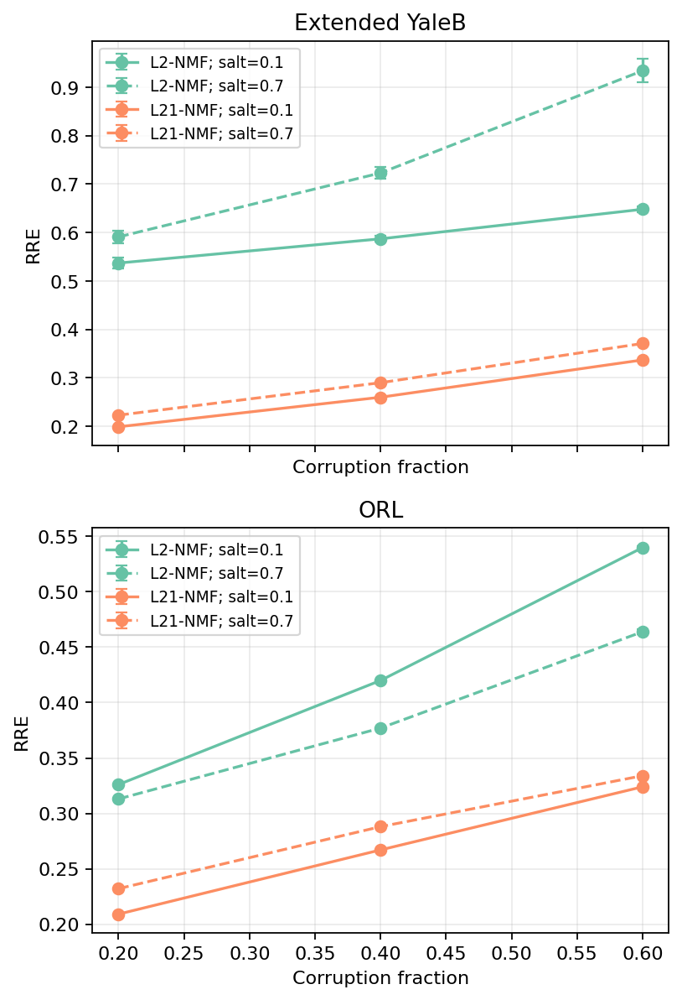
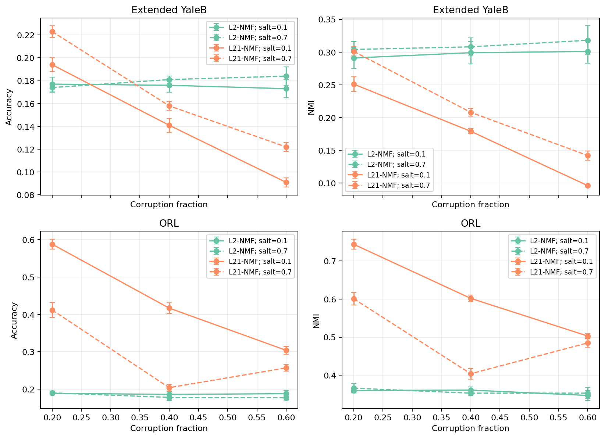

[English](README.md) | [简体中文](README.zh-CN.md)

# 鲁棒 NMF 人脸重建

这是一个面向 AI/ML 与数据科学作品集的项目，用于研究椒盐噪声破坏下的低秩人脸重建。仓库将已完成的团队实验整理为可测试的 Python 包，包含确定性数据加载、经验证的噪声模型、从零实现的 L2-NMF、带显式列稀疏残差的 L2,1 导向鲁棒分解、聚类评估和可复现可视化。

实验流程面向 ORL 与 Extended YaleB 人脸数据集。重建质量使用相对重建误差（RRE）衡量；系数表示使用聚类准确率（Accuracy）和归一化互信息（NMI）评估。

## 关键结果

下表数值来自 [`summary.csv`](results/metrics/summary.csv)：对每个数据集和方法的六组噪声比例/盐噪声比例设置取均值，并四舍五入到三位小数。它们是已完成历史实验的聚合结果；冒烟测试和当前重构均未复现这些数值。

<!-- aggregate-results:start -->
| 数据集 | 方法 | RRE ↓ | Accuracy ↑ | NMI ↑ |
|---|---:|---:|---:|---:|
| ORL | L2-NMF | 0.407 | 0.185 | 0.357 |
| ORL | L21-NMF | 0.276 | 0.364 | 0.557 |
| Extended YaleB | L2-NMF | 0.670 | 0.178 | 0.304 |
| Extended YaleB | L21-NMF | 0.280 | 0.155 | 0.196 |
<!-- aggregate-results:end -->

在全部已存设置中，L21-NMF 的 RRE 均低于 L2-NMF；它在 ORL 的 Accuracy 与 NMI 上也均占优势。Extended YaleB 的聚类结果则较为混合：Accuracy 的领先方法随设置变化，而 L2-NMF 的 NMI 在整个已存网格中更高。

这些比较需要谨慎解读。历史干净数据协议并不对称：L2,1-NMF 固定已学习的基矩阵并在干净数据上重新拟合系数，而 L2-NMF 直接评估从含噪数据学得的因子、未在干净数据上重新拟合。因此，归档结果并不能在完全对称的协议下单独归因于损失函数。来源摘要、表格映射、精度限制与验证流程见 [`PROVENANCE.md`](results/metrics/PROVENANCE.md)。





## 团队项目与我的贡献

这是一个四人团队项目，所有身份信息均有意省略。

我的贡献是：

- 实现并验证了椒盐噪声生成器。
- 实现了 L2-NMF 基线，并对照文献检查其目标函数和更新规则。
- 研究并整理了支持背景与研究动机的参考文献。
- 参与构建对比方法的理论框架与解释。

L2,1 导向的鲁棒实现和项目整体均为团队成果；我不会将二者表述为由我独立完成。

## 架构

| 模块 | 职责 |
|---|---|
| `robust_nmf.data` | 严格的 `root/class/image` 加载、灰度转换、缩放、归一化与确定性标签 |
| `robust_nmf.noise` | 基于种子的椒盐噪声，精确选择不重复位置 |
| `robust_nmf.nmf` | 从零实现的 L2-NMF 与基于鲁棒残差的分解 |
| `robust_nmf.metrics` | 数值尺度安全的 RRE，以及经匈牙利算法对齐的聚类 Accuracy 与 NMI |
| `robust_nmf.visualization` | 历史结果摘要验证与对比图 |
| `scripts/` | 合成数据冒烟实验、绘图、报告脱敏与来源验证 |

```text
.
├── data/                         # 本地数据集（不纳入版本控制）
├── docs/
│   └── robust_nmf_technical_report.pdf
├── notebooks/
│   └── robust_nmf_experiments.ipynb
├── results/
│   ├── figures/                  # 精选聚合结果图
│   └── metrics/                  # 历史摘要与来源记录
├── scripts/                      # 冒烟、绘图、脱敏、验证
├── src/robust_nmf/               # 包源代码
└── tests/                        # 单元、集成与文档检查
```

## 快速开始

需要 Python 3.10 或更高版本。

```console
python -m venv .venv
```

在 Windows PowerShell 中激活：

```powershell
.venv\Scripts\Activate.ps1
```

在 Linux 或 macOS 中激活：

```bash
source .venv/bin/activate
```

安装包与开发/报告扩展依赖，然后运行验证：

```console
python -m pip install -e ".[dev,report]"
python -m pytest
python scripts/smoke_experiment.py
python scripts/generate_result_figures.py
```

冒烟实验使用小型、确定性的合成矩阵，仅检查 RRE 有限和因子非负；它不是基准测试，也不会复现已存的人脸数据集结果。

## 数据布局

原始图像被有意排除。请遵循 [`data/README.md`](data/README.md) 中的许可与来源说明，并按加载器要求放置文件：

```text
data/
├── ORL/
│   ├── subject_01/
│   │   ├── image_01.pgm
│   │   └── ...
│   └── ...
└── CroppedYaleB/
    ├── subject_01/
    │   ├── image_01.pgm
    │   └── ...
    └── ...
```

每个受支持的图像必须恰好位于数据集根目录下一层类别目录中。支持 `.pgm`、`.png`、`.jpg`、`.jpeg`、`.bmp`、`.tif` 和 `.tiff`。

## Notebook 与报告

安装 Notebook 界面并从仓库根目录启动：

```console
python -m pip install jupyterlab
python -m jupyter lab notebooks/robust_nmf_experiments.ipynb
```

Notebook 将可选的本地数据重跑与已存聚合证据的可视化分开。随附的 [`robust_nmf_technical_report.pdf`](docs/robust_nmf_technical_report.pdf) 是经过匿名化/脱敏的团队技术报告，也是历史材料；它并非由我独立编写的包文档。

## 可复现性

- 算法、噪声和聚类入口均接受显式随机种子。
- 加载器使用确定性的路径与类别排序。
- `summary.csv` 在绘图前会进行模式验证。
- `python scripts/generate_result_figures.py` 可重新生成两张已纳入版本控制的聚合图。
- `python scripts/verify_result_provenance.py --report PATH --csv results/metrics/summary.csv` 可用本地归档报告对照已记录摘要和表格数值。
- 新的本地数据运行采用新的对称评估协议，并非归档实验的精确回放。

## 局限

- 本仓库不分发人脸数据集，完整实验需要自行获取并验证数据。
- 已存数值仅保留历史报告的三位小数精度，且没有逐次运行观测值。
- 历史跨方法评估使用了不对称的干净数据协议。
- 当前鲁棒求解器是 L2,1 导向的残差模型；不声称全局收敛，也不声称与所有名为“L2,1-NMF”的公式等价。
- 聚类结果会受到表示质量、初始化方式与评估协议影响。

## 权利说明

> License scope: The MIT License applies only to newly organized project source code and configuration. It does not license `docs/*.pdf`, raw or derived datasets, historical experiment metrics or figures transcribed from team work, or third-party/cited works.

代码许可见 [MIT License](LICENSE)，各组件的具体权利见 [`RIGHTS.md`](RIGHTS.md)，匿名化/脱敏团队技术报告的说明见[报告权利说明](docs/README.md)。
